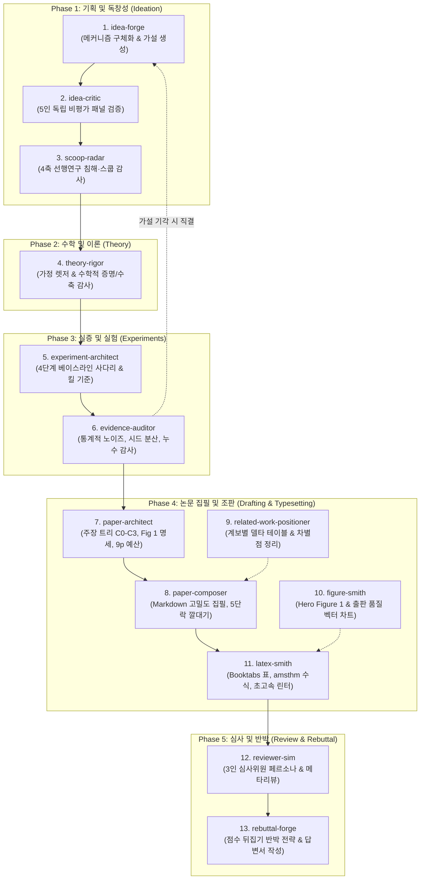

# 탑티어 기계학습(ML) 학술 연구 및 논문 엔지니어링 스킬셋

[](https://opensource.org/licenses/MIT)
[](https://www.python.org/)
[](https://neurips.cc/)
[-brightgreen.svg)]()

> **아이디어 착상부터 학회 제출 출판 품질(Camera-Ready)까지.**  
> AI 코딩 에이전트(**Claude Code**, **Google Antigravity**, **Cursor**, **Windsurf**)를 위한 모듈형·증거 기반·무군더더기(Zero-Fluff) 학술 논문 엔지니어링 스킬셋입니다.  
> 
> *[English Guide (README.md)](./README.md)*

---

## 🏛️ 거장들의 어깨 위에 서서 (Foundations)

일반적인 범용 프롬프트들은 철학 에세이, 인문사회 리포트, 또는 단순 서베이 논문 형식에 맞춰져 있어 기계학습 탑티어 학회(ICLR, NeurIPS, ICML)에서 요구하는 엄밀성을 만족할 수 없습니다.

본 스킬셋은 **컴퓨터 과학 및 기계학습계를 이끄는 세계적 석학 6인의 정립된 연구 방법론과 경고**를 철저히 시스템화하여 구축되었습니다:

```
+---------------------------------------------------------------------------------------------------------------+
|                                      세계적 석학들의 핵심 가르침과 스킬셋 반영                                |
+--------------------------------+--------------------------------------+---------------------------------------+
| 석학 및 소속 기관              | 대표 논문 및 기념비적 강의           | 본 스킬셋에 반영된 엔지니어링 규칙    |
+--------------------------------+--------------------------------------+---------------------------------------+
| **Zachary Lipton** (CMU) &     | "Troubling Trends in Machine         | • 자동화된 AI 상투어구(Cliché) 박멸   |
| **Jacob Steinhardt** (Stanford)| Learning Scholarship" (ICML/CACM)    | • 설명(Fact)과 추측(Speculation) 엄격 분리|
|                                |                                      | • 허세 수학(Mathiness) 퇴출 & 능동 동사|
+--------------------------------+--------------------------------------+---------------------------------------+
| **Simon Peyton Jones**         | "How to Write a Great Research       | • 1페이지에서 핵심 가설(C0) 즉시 폭로 |
| (Microsoft Research / Cambridge| Paper" (CS 연구자의 7대 황금률)      | • 3개의 반증 가능한 구체적 기여점 불릿|
|                                |                                      | • 연구 일기가 아닌 단단한 서사(Story) |
+--------------------------------+--------------------------------------+---------------------------------------+
| **Bill Freeman** (MIT CSAIL) & | "How to Write a Good Paper /         | • 5분 커피 테스트 (The Coffee Test)   |
| **Ted Adelson** (MIT)          | CVPR Submission" (Adelson 공식)      | • 5단락 서론 깔대기 (Introduction Funnel)|
|                                |                                      | • Hero Figure (핵심을 관통하는 Fig 1) |
+--------------------------------+--------------------------------------+---------------------------------------+
| **Joelle Pineau** (McGill /    | "The Machine Learning                | • 다중 시드 오차범위(μ ± σ) 의무화   |
| Mila / Meta AI VP)             | Reproducibility Checklist"           | • 베이스라인과 공정한 튜닝 예산 동등성|
|                                | (NeurIPS/ICLR 공식 재현성 규격)      | • 데이터 누수 원천 차단 & 가정 렛저  |
+--------------------------------+--------------------------------------+---------------------------------------+
| **Devi Parikh** &              | "How We Write Papers: A              | • Coarse-to-Fine (단락별 뼈대 선행)   |
| **Dhruv Batra** (GT / FAIR)    | Step-by-Step Guide"                  | • "지우지 말고 압축하라" 밀도 향상    |
+--------------------------------+--------------------------------------+---------------------------------------+
| **Michael J. Black**           | "The Craft of Paper Writing &        | • Booktabs 표 (세로선 '|' 100% 제거)  |
| (Max Planck Institute)         | Novelty in Science"                  | • 컴파일 무결성 & 수학적 조판 분리    |
+--------------------------------+--------------------------------------+---------------------------------------+
```

---

## 🔄 5단계 13개 정예 스킬 생애주기

본 스킬셋은 연구의 전 주기를 **5단계 13개의 독립적이고 정밀한 모듈형 스킬**로 완벽하게 지원합니다:



---

## ⚡ "논문 기획 vs 실험 설계" 실행 순서 딜레마 완벽 해결 (2-Pass 루프)

> *"논문 구조를 먼저 짜야 할까요(`paper-architect`), 실험을 먼저 설계해야 할까요(`experiment-architect`)?"*

이 딜레마는 프로 연구팀들의 **2-Pass (가설 세우기 $\to$ 실험 검증 $\to$ 구조 확정)** 루프로 명쾌하게 해결됩니다:

1. **Pass 1 (실험 전: 가설 잠금)**:
   - `paper-architect`를 가볍게 실행하여 **핵심 주장($C_0$)과 주요 서브 주장($C_1, C_2, C_3$)을 25단어 이내로 못 박습니다.** (Simon Peyton Jones: *"무엇을 주장할지 모른 채 실험부터 돌리지 마라"*).
   - 이 주장 트리를 `experiment-architect`에 넘겨, 그 주장을 반증(Falsify)하기 위한 4단계 베이스라인 사다리와 킬 스위치를 설계합니다.
2. **실험 수행 및 실증 감사**:
   - 최소 5개 이상의 시드로 실험을 수행하고, `evidence-auditor`가 통계적 유의성, 튜닝 공정성, 데이터 누수 여부를 감사하여 살아남은 팩트를 확정합니다.
3. **Pass 2 (실험 후: 논문 구조 및 도판 확정)**:
   - `paper-architect`를 다시 호출하여 살아남은 숫자를 기반으로 `Table 1`, `Figure 1`, 그리고 학회 9페이지 분량 예산을 최종 확정합니다.
   - `paper-composer`가 고밀도 본문을 집필하고 `latex-smith`가 출판 품질로 조판합니다.

---

## 🛡️ 토큰 소모 0개, 50ms 미만 초고속 결정론적 CLI 린터

수천 개의 LLM 토큰을 낭비하며 들쭉날쭉 채점하는 프롬프트 기반 평가와 달리, 본 스킬셋은 **Python 표준 라이브러리 기반의 100% 결정론적 CLI 린터**를 제공합니다:

### 1. `check_prose.py` (문체 및 문장 호흡 린터)
경로: `.agents/skills/paper-composer/scripts/check_prose.py`
- **AI 클리셰 박멸**: `delve into`, `pivotal role`, `testament`, `crucial`, `tapestry` 등 18개 핵심 상투어구 정규식 검출.
- **문장 리듬 및 약어 보호**: `et al.`, `e.g.`, `i.e.`, 소수점 숫자(`0.954`)에서 문장이 쪼개지는 버그를 완벽 방지하고, 4문장 이상 단조로운 길이가 이어지면 운율 경고 출력.
- **실행 방법**:
  ```bash
  python3 .agents/skills/paper-composer/scripts/check_prose.py draft/*.md
  ```

### 2. `check_latex.py` (조판 및 제출 무결성 린터)
경로: `.agents/skills/latex-smith/scripts/check_latex.py`
- **Booktabs 표준 강제**: `tabular`, `tabular*`, `tabularx` 선언부의 모든 중괄호를 파싱하여 **세로선(`|`) 완벽 차단**.
- **구형 수식 환경 차단**: 자간/행간을 망치는 `\begin{eqnarray}` 및 TeX 원시 기호 `$$...$$` 검출 시 빌드 중단 (`align` 사용 강제).
- **BibTeX 인용 닫힘성 검증**: 본문의 모든 `\cite`, `\citep`, `\citet` 키가 `.bib` 파일에 실제로 존재하는지 대조하여 **`[?]` 표시 원천 차단**.
- **상호 참조 무결성 검증**: 본문의 `\Cref`, `\ref`, `\eqref`가 유효한 `\label{...}`과 매칭되는지 전수 조사하여 **`??` 표시 원천 차단**.
- **실행 방법**:
  ```bash
  python3 .agents/skills/latex-smith/scripts/check_latex.py paper/main.tex --bib references.bib
  ```

---

## 📂 디렉토리 구조

```
.agents/
├── README.md                      # 영문 마스터 가이드
├── README.ko-KR.md                # 한국어 마스터 가이드 (현재 문서)
├── references/
│   └── top_tier_ml_writing_principles.md  # 전 스킬 공통 거장들의 작성 원칙
└── skills/
    ├── idea-forge/                # Phase 1: 가설 및 수학적 메커니즘 구체화
    ├── idea-critic/               # Phase 1: 5인 가상 비평가 블라인드 검증
    ├── scoop-radar/               # Phase 1: 4축 선행연구 충돌 및 스쿱 감사
    ├── theory-rigor/              # Phase 2: 이론적 가정 렛저 및 수축/경계 증명
    ├── experiment-architect/      # Phase 3: 4단계 베이스라인 사다리 & 킬 기준
    ├── evidence-auditor/          # Phase 3: 통계적 노이즈 및 다중 시드 분산 감사
    ├── paper-architect/           # Phase 4: 주장 트리 & 5단락 서론 깔대기 기획
    ├── paper-composer/            # Phase 4: 고밀도 Markdown 본문 초안 집필
    │   └── scripts/check_prose.py # 결정론적 AI 어휘 박멸 & 문장 호흡 CLI 린터
    ├── related-work-positioner/   # Phase 4: 연구 계보 묶기 & 델타 테이블 작성
    ├── figure-smith/              # Phase 4: Hero Figure 1 & 출판용 벡터 플롯
    ├── latex-smith/               # Phase 4: ICLR/NeurIPS 공식 LaTeX 조판
    │   └── scripts/check_latex.py # 결정론적 Booktabs & 컴파일 무결성 CLI 린터
    ├── reviewer-sim/              # Phase 5: 다중 페르소나 모의 심사 & 메타리뷰
    └── rebuttal-forge/            # Phase 5: 점수 역전 반박 전략 및 답변서 작성
```

---

## 🚀 빠른 시작 가이드 (Quickstart)

### 1. AI 에이전트(Claude Code, Antigravity, Cursor)에서 사용하기
`.agents/` 폴더를 프로젝트 루트에 배치하기만 하면 에이전트가 자연어로 즉시 인식합니다:

- *"우리 모델의 핵심 주장 트리와 5단락 서론 깔대기를 기획해줘."*  
  $\to$ **`paper-architect`** 자동 트리거
- *"주장 트리와 노테이션 렛저를 기반으로 Section 3 (Methodology) 초안을 써줘."*  
  $\to$ **`paper-composer`** 자동 트리거
- *"작성된 마크다운을 공식 ICLR 템플릿의 LaTeX로 변환하고 표를 린팅해줘."*  
  $\to$ **`latex-smith`** 자동 트리거
- *"까다로운 심사위원 3명과 Area Chair 페르소나로 가상 모의 심사를 돌려줘."*  
  $\to$ **`reviewer-sim`** 자동 트리거

### 2. CI/CD 및 Git Pre-commit 연동
코드 변경 시 논문의 조판 및 문체 품질을 자동으로 검증할 수 있습니다:

```bash
# Makefile 또는 GitHub Actions 연동 예시:
test-paper:
	python3 .agents/skills/paper-composer/scripts/check_prose.py draft/*.md
	python3 .agents/skills/latex-smith/scripts/check_latex.py paper/main.tex --bib paper/references.bib
```

---

## 📄 라이선스 (License)
본 프로젝트는 [MIT License](https://opensource.org/licenses/MIT)를 따릅니다. 학술 연구, 개인 프로젝트, 상업적 연구에 자유롭게 사용 및 배포하실 수 있습니다.
