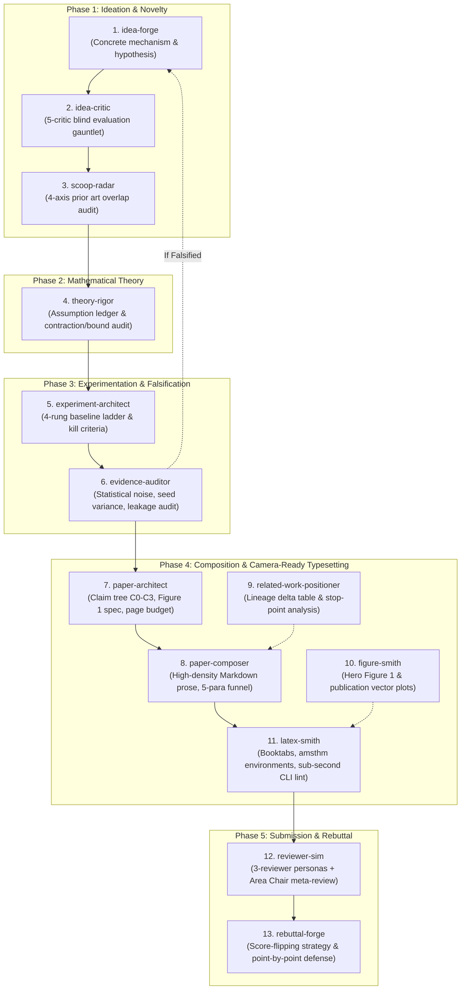

# Top-Tier ML Academic Research & Paper Engineering Suite

[](https://opensource.org/licenses/MIT)
[](https://www.python.org/)
[](https://neurips.cc/)
[-brightgreen.svg)]()

> **From Initial Spark to Camera-Ready Manuscript.**  
> A modular, evidence-grounded, zero-fluff academic research and paper engineering skillset designed for AI coding agents (**Claude Code**, **Google Antigravity**, **Cursor**, **Windsurf**).  
> 
> *[한국어 안내서 (README.ko-KR.md)](./README.ko-KR.md)*

---

## 🏛️ Built on the Shoulders of Giants

Unlike generic academic prompts tailored for qualitative essays, social science memos, or simple survey formatting, this suite was engineered from the ground up on the **formal methodologies, warnings, and guidelines of world-renowned computer science and machine learning leaders**:

```
+-------------------------------------------------------------------------------------------------------------+
|                                    FOUNDATIONAL SCHOLARLY PILLARS                                           |
+------------------------------+------------------------------------+-----------------------------------------+
| Scholar & Institution        | Classic Reference / Milestone      | Architectural Translation in this Suite |
+------------------------------+------------------------------------+-----------------------------------------+
| **Zachary Lipton** (CMU) &   | "Troubling Trends in Machine       | • Automated anti-AI cliché linter       |
| **Jacob Steinhardt** (Stanf) | Learning Scholarship" (ICML/CACM)  | • Hard separation of Explanation vs Spec|
|                              |                                    | • Mathiness ban & active scientific verb|
+------------------------------+------------------------------------+-----------------------------------------+
| **Simon Peyton Jones**       | "How to Write a Great Research     | • Core Claim C0 locked on Page 1        |
| (Microsoft Research / Camb)  | Paper" (The 7 CS Golden Rules)     | • 3 concrete, falsifiable contributions |
|                              |                                    | • Narrative storytelling over diary     |
+------------------------------+------------------------------------+-----------------------------------------+
| **Bill Freeman** (MIT CSAIL) | "How to Write a Good Paper /       | • The 5-Minute Coffee Test              |
| & **Ted Adelson** (MIT)      | CVPR Submission" (Adelson Formula) | • 5-Paragraph Introduction Funnel       |
|                              |                                    | • "Hero Figure" (Figure 1 as the anchor)|
+------------------------------+------------------------------------+-----------------------------------------+
| **Joelle Pineau** (McGill /  | "The Machine Learning              | • Mandatory multi-seed error bars (μ±σ) |
| Mila / Meta AI VP)           | Reproducibility Checklist"         | • Strict tuning parity across baselines |
|                              | (NeurIPS/ICLR Official Mandate)    | • Zero-leakage protocol & assumption led|
+------------------------------+------------------------------------+-----------------------------------------+
| **Devi Parikh** &            | "How We Write Papers: A            | • Coarse-to-Fine (Intro Skeleton first) |
| **Dhruv Batra** (GT / FAIR)  | Step-by-Step Guide"                | • "Tighten, don't delete" density pass  |
+------------------------------+------------------------------------+-----------------------------------------+
| **Michael J. Black**         | "The Craft of Paper Writing &      | • Booktabs tables (zero vertical rules) |
| (Max Planck Institute)       | Novelty in Science"                | • Decoupled typesetting & LaTeX hygiene |
+------------------------------+------------------------------------+-----------------------------------------+
```

---

## 🔄 The Complete 5-Phase, 13-Skill Lifecycle

The suite decomposes top-tier research into 13 specialized, decoupled skills:



---

## ⚡ The 2-Pass Workflow: Resolving the "Architect Dilemma"

> *"Should `paper-architect` come before or after `experiment-architect`?"*

Top researchers resolve this with a **Two-Pass Loop**:
1. **Pass 1 (Pre-Experiment — Claim Seeding)**:
   - Run `paper-architect` to define the **Core Claim ($C_0$)** and key sub-claims ($C_1, C_2, C_3$) in $\le 25$ words. (As Simon Peyton Jones teaches: *"Know what you are claiming before running anything"*).
   - Pass the claim tree to `experiment-architect`, which designs the 4-rung compute-matched baseline ladder, ablations, and pre-registered kill criteria.
2. **Experiment Execution & Evidence Audit**:
   - Run experiments over $\ge 5$ seeds. `evidence-auditor` checks statistical significance, tuning parity, and zero-leakage protocols.
3. **Pass 2 (Post-Experiment — Narrative Finalization)**:
   - Re-run `paper-architect` to bind surviving empirical facts to `Table 1`, `Figure 1`, and lock the 9-page conference budget.
   - `paper-composer` drafts the prose section-by-section, followed by `latex-smith` for compilation.

---

## 🛡️ Deterministic Static Linters (Zero-Token CLI Verification)

Unlike other frameworks that waste thousands of LLM tokens on probabilistic self-evaluations, this suite provides **instant (<50ms), 100% deterministic Python standard-library CLI linters**:

### 1. `check_prose.py` (Draft Prose & Cadence Quality)
Located in `.agents/skills/paper-composer/scripts/check_prose.py`:
- **AI Cliché Killer**: Scans for 18 inflected clichés (`\bdelv\w*\b`, `\bpivotal\w*\b`, `\btestament\b`, `\bcrucial\b`, `\btapestr\w*\b`, `\bplays an? (?:important|pivotal|crucial) role\b`).
- **Cadence & Rhythm Analyzer**: Protects abbreviations (`et al.`, `e.g.`, `i.e.`, decimals like `0.954`) and detects monotonous consecutive sentence runs ($\ge 4$ sentences within $\le 3$ words).
- **Usage**:
  ```bash
  python3 .agents/skills/paper-composer/scripts/check_prose.py draft/*.md
  ```

### 2. `check_latex.py` (Typography & Submission Integrity)
Located in `.agents/skills/latex-smith/scripts/check_latex.py`:
- **Booktabs Invariant**: Scans all `tabular`, `tabular*`, and `tabularx` declarations; strictly bans vertical pipe lines (`|`).
- **Deprecated Math Detector**: Halts build on obsolete `\begin{eqnarray}` or TeX primitive `$$...$$` in favor of `amsmath` `align` and `\[ ... \]`.
- **BibTeX Closure**: Compares all `\cite`, `\citep`, `\citet` invocations against `@\w+\{key,` in your `.bib` to eliminate `[?]` artifacts.
- **Label Resolution**: Cross-checks all `\ref`, `\Cref`, `\eqref` against declared `\label{...}` to eliminate embarrassing `??` marks.
- **Usage**:
  ```bash
  python3 .agents/skills/latex-smith/scripts/check_latex.py paper/main.tex --bib references.bib
  ```

---

## 📂 Directory Layout

```
.agents/
├── README.md                      # English master guide (You are here)
├── README.ko-KR.md                # Korean master guide (한국어 버전)
├── references/
│   └── top_tier_ml_writing_principles.md  # Global writing rules across all skills
└── skills/
    ├── idea-forge/                # Phase 1: Mechanism & hypothesis formulation
    ├── idea-critic/               # Phase 1: 5-critic blind gauntlet
    ├── scoop-radar/               # Phase 1: 4-axis prior art collision check
    ├── theory-rigor/              # Phase 2: Theoretical assumptions & proof ledger
    ├── experiment-architect/      # Phase 3: 4-rung baselines & kill criteria
    ├── evidence-auditor/          # Phase 3: Statistical noise & multi-seed audit
    ├── paper-architect/           # Phase 4: Claim tree & 5-paragraph funnel plan
    ├── paper-composer/            # Phase 4: High-density Markdown prose generation
    │   └── scripts/check_prose.py # Deterministic anti-AI & cadence CLI linter
    ├── related-work-positioner/   # Phase 4: Lineage grouping & delta table
    ├── figure-smith/              # Phase 4: Hero Figure 1 & publication vector plots
    ├── latex-smith/               # Phase 4: ICLR/NeurIPS LaTeX typesetting
    │   └── scripts/check_latex.py # Deterministic Booktabs & compilation CLI linter
    ├── reviewer-sim/              # Phase 5: Multi-persona simulated review panel
    └── rebuttal-forge/            # Phase 5: Score-flipping rebuttal strategy
```

---

## 🚀 Quickstart Guide

### 1. In AI Agent Environments (Claude Code, Antigravity, Cursor)
Drop the `.agents/` folder into your project root. When you need a task executed, trigger the skill naturally:

- *"Let's build the claim tree and 5-paragraph introduction for our new model."*  
  $\to$ Triggers **`paper-architect`**
- *"Draft Section 3 (Methodology) based on our claim tree and notation ledger."*  
  $\to$ Triggers **`paper-composer`**
- *"Convert our markdown draft into camera-ready ICLR LaTeX and lint the tables."*  
  $\to$ Triggers **`latex-smith`**
- *"Simulate an ICLR review panel with three harsh reviewers and an Area Chair."*  
  $\to$ Triggers **`reviewer-sim`**

### 2. CI/CD & Pre-commit Integration
Add deterministic linters to your repository's automated testing pipeline:

```bash
# In your Makefile or GitHub Actions workflow:
test-paper:
	python3 .agents/skills/paper-composer/scripts/check_prose.py draft/*.md
	python3 .agents/skills/latex-smith/scripts/check_latex.py paper/main.tex --bib paper/references.bib
```

---

## 📄 License
Released under the [MIT License](https://opensource.org/licenses/MIT). Free for academic, personal, and commercial research.
