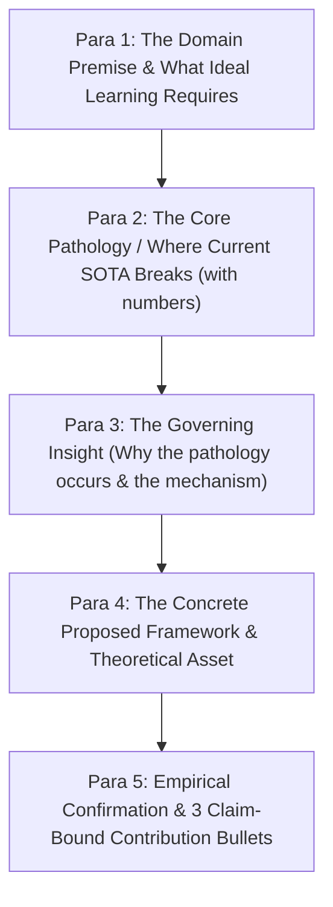

# Paper Composer

A paper is not a dump of thoughts; it is an unbroken chain of claims advancing a thesis.
The composer takes `claim-tree.json`, audited experimental data (`parity_results.json` / `evidence-audit.json`),
and produces crisp, publication-grade academic prose in Markdown.

**The Golden Rule**: Every paragraph exists to establish or defend exactly one sub-claim in the claim tree.
If a paragraph cannot state which claim it serves, it is cut.

---

## Input Prerequisites

1. `claim-tree.json` (from `paper-architect`) — the core claim $C_0$ and sub-claims $C_1, C_2, C_3$.
2. Verified experimental outputs (e.g. `experiments/results/.../benchmark_results.json`).
3. Mathematical definitions/theorems (from `theory-rigor`).

---

## 1. Style Calibration & The Anti-AI Filter

Reviewers reject papers that "feel like ChatGPT." Academic prose in top venues (ICLR, NeurIPS, ICML)
is economical, dense, and assertive.

### Banned Fluff & Replacements

| ✗ Banned AI Cliché | ✓ Publication Replacement | Rationale |
|---|---|---|
| "In this paper, we propose..." | "We present [Method], a framework that..." | Skip the throat-clearing; state the object. |
| "plays a crucial/pivotal role" | "governs", "determines", "constrains" | Vague importance vs physical mechanism. |
| "delve into / explore" | "examine", "characterize", "analyze" | Informal colloquialism vs scientific rigor. |
| "is a testament to" | "evidences", "demonstrates", "confirms" | Melodramatic hyperbole vs empirical statement. |
| "revolutionize / unleash" | "improves", "extends", "generalizes" | Marketing hype triggers immediate skepticism. |
| "It is worth noting that..." | *(Delete phrase and state the fact directly)* | Empty filler that dilutes sentence force. |
| "meticulously designed" | *(Delete entirely)* | Let the mathematics show the care; do not claim it. |

### The Assertive Scientific Voice
- **Active Voice for Authors**: "We prove Theorem 1...", "We observe that...", "We isolate..."
- **Inanimate Subject for Physics/Math**: "The projection operator bounds...", "The loss surface degenerates..."
- **No Hedging on Verified Results**: When numbers are measured over multiple seeds, state the exact quantitative delta: e.g., *"[Method] achieves $0.954$, outperforming [Baseline] by $+0.268$"* rather than *"[Method] seems to perform relatively well."*

---

## 2. Section 1: The 5-Paragraph Introduction Funnel

The Introduction determines the reviewer's initial score. It must follow the strict 5-paragraph funnel:

### Para 1: Domain Premise
Set up the problem setting. What is the fundamental objective of the task (e.g., continuous control, sequence modeling, dynamic estimation)? What must an ideal model represent, guarantee, or preserve (e.g., consistency, stability, monotonic invariants)?

### Para 2: The Core Pathology (The Attack on SOTA)
Identify the structural bottleneck of current methods:
- Expose the exact failure mode of existing baselines (e.g., gradient explosions, representation collapse, sample inefficiency, or variance blowup).
- Cite concrete numerical evidence or theoretical limits showing where and why prior approaches break down.

### Para 3: The Governing Insight
Explain the breakthrough principle: Why does the pathology occur, and what fundamental mechanism resolves it? Frame this as a principled mathematical or architectural insight (e.g., reformulating in distribution space, introducing an invariant operator, or decoupling orthogonal representations).

### Para 4: The Proposed Framework
Introduce the core technical contribution:
1. The mathematical operator, architecture, or objective function that embodies the governing insight.
2. How the design eliminates the pathology identified in Para 2 without introducing heuristic clamping or artificial regularizers.
3. **Formal Guarantee**: The core theoretical asset (e.g., Theorem 1: contraction mapping, convergence bound, or optimality guarantee).

### Para 5: Summary of Contributions
Three sharp, unassailable contribution bullets tied directly to $C_1, C_2, C_3$:
1. **Theoretical**: A formal framework with proven mathematical guarantees (e.g., contraction, convergence, or identifiability) ($C_1$).
2. **Methodological**: A scalable, principled algorithmic instantiation eliminating prior architectural pathologies ($C_2$).
3. **Empirical**: Statistically significant gains across multi-seed benchmarks, accompanied by rigorous ablation and baseline failure attribution ($C_3$).

---

## 3. Section 2 & 3: Methodology Architecture

### A. Notation Ledger First
Never introduce a symbol inside an equation without defining it first:
- Define all state spaces, action spaces, observation trajectories, or probability distributions formally.
- Group notations in a dedicated definition paragraph or table before deriving objectives.

### B. The "Naive Failure $\to$ Proposed Solution" Progression
1. **State the Standard/Naive Formulation**: Present the baseline formulation or conventional objective.
2. **Expose the Mathematical Failure Mode**: Show analytically where the formulation degenerates (e.g., zero denominators, non-contractive updates, or unbounded variance).
3. **Derive the Proposed Formulation**: Introduce the proposed operator, loss, or architecture that resolves the degeneracy.
4. **State Formal Theorems**: Present Theorems and Lemmas cleanly with explicit assumptions and proof sketches in the main text.

---

## 4. Section 4: Experiments (The Argument, Not the Ledger)

An experiment section is not a passive data dump. It is a structured scientific argument:

1. **Experimental Setup & Protocol**:
   - Explicitly declare **tuning parity**: all baselines evaluated on identical splits with hyperparameters swept across equivalent compute budgets.
   - Declare the strict **zero-data-leakage protocol** (preprocessing fitted strictly on training splits).
2. **Main Comparative Results Table**:
   - Reference the main benchmark table (formatted with `booktabs`, mean $\pm$ std over $\ge 5$ seeds).
   - Lead with the takeaway sentence stating the primary empirical finding and quantitative margin.
3. **Mechanistic Baseline Failure Attribution**:
   - Explain *why* competitors failed based on physical or architectural limitations (e.g., receptive field limits, optimization instability, or representation collapse).
4. **Ablation Studies**:
   - Isolate each proposed component independently.
   - Prove that empirical gains stem from the claimed theoretical mechanism, not auxiliary tuning.

---

## 5. Composition Checklist & Output Artifacts

Before declaring a draft section complete, run this audit:

- [ ] Every paragraph serves an explicit claim ID from `claim-tree.json`.
- [ ] Automated prose audit passed (`python3 scripts/check_prose.py draft/*.md`).
- [ ] All numerical claims match audited JSON results exactly.
- [ ] All citations use provisional keys `[@authorYYYY]` ready for `latex-smith`.
- [ ] Standard deviations / confidence intervals accompany all comparative metrics ($\mu \pm \sigma$).

**Outputs**:
- `draft/01_introduction.md`
- `draft/02_problem_formulation.md`
- `draft/03_methodology.md`
- `draft/04_experiments.md`
- `draft/05_discussion.md`
