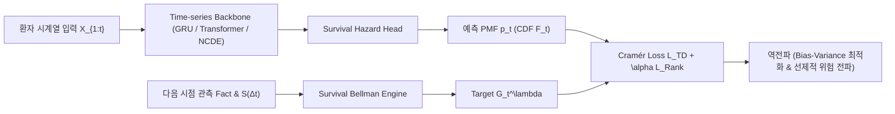

# SurvTD: Survival Temporal Difference Learning for Dynamic Early Warning

> **SurvTD**는 불규칙 시계열 및 중도절단(Right-Censored) 데이터 환경에서, 강화학습의 **Survival Bellman Operator 및 Multi-step $\lambda$-Return**을 도입하여 표본 효율성과 조기 경보 선행 시간(Lead Time)을 극대화하는 새로운 연속시간 생존분석 학습 프레임워크입니다.

---

## 📚 문서 목차 (Documentation)

컴퓨터공학/AI 전공자가 직관적으로 이해하고 바로 구현할 수 있도록 영역별로 체계적으로 정리되어 있습니다.

| 번호 | 문서명 | 주요 내용 |
| :---: | :--- | :--- |
| **00** | [**Part 0. 필수 문헌 독서 가이드**](docs/00_literature_reading_guide.md) | Dynamic-DeepHit, Spotify NeurIPS 2022, C51 등 핵심 논문 우선순위 및 공략 가이드 |
| **01** | [**Part 1. 연구 배경, 문제 정의 및 포지셔닝**](docs/01_motivation_and_framing.md) | 기존 Monte Carlo(NLL) 방식의 한계, TD 도입 동기, 단순 스무딩이 아닌 **Bias-Variance 최적화**로의 논문 포지셔닝 |
| **02** | [**Part 2. 이론적 정식화 및 수학적 유도**](docs/02_mathematical_formulation.md) | 용어 텐서 번역 사전, Survival Bellman Operator 엄밀 유도, $\div S$ 축퇴 오류와 $\times S$ 해결책, $\lambda$-Return |
| **03** | [**Part 3. 모델 아키텍처 및 손실 함수**](docs/03_loss_and_architecture.md) | Model-Agnostic 파이프라인, Cramér Distance (CDF $L_2$) Loss, Ranking Loss, PyTorch 구현 코드 |
| **04** | [**Part 4. 실험 설계 및 단계별 검증**](docs/04_experimental_design.md) | Phase 1 (합성 데이터 & NASA C-MAPSS Go/No-Go 검증) $\to$ Phase 2 (MIMIC-IV AKI & Sepsis 임상 실증) |
| **05** | [**Part 5. 베이스라인 및 리뷰어 방어 전략**](docs/05_baselines_and_defense.md) | 동적 생존분석 SOTA군 (DDH, RDSM, SLODE 등), 필수 Trivial Heuristics 방어군 (EMA 스무딩, Hysteresis) |
| **06** | [**Part 6. 킬러 평가 지표 및 분석**](docs/06_killer_metrics_and_analysis.md) | 순환논증 탈출, 변동성 분해 (정보성 갱신 vs 잡음 지터), Lead Time vs Precision, Pareto Frontier |

---

## ⚡ 핵심 요약 (Quick Architecture Overview)

---

## 🚀 빠른 시작 (Next Steps)
1. [Part 0. 필수 문헌 독서 가이드](docs/00_literature_reading_guide.md)의 Tier 1 논문 3편 확인
2. [Part 1](docs/01_motivation_and_framing.md)과 [Part 2](docs/02_mathematical_formulation.md)를 통해 수학적 직관과 논문 프레이밍 숙지
3. [Part 3](docs/03_loss_and_architecture.md)의 파이토치 코드를 기반으로 손실 함수 프로토타입 작성
4. [Part 4](docs/04_experimental_design.md)의 Phase 1 합성 데이터 실험으로 $\lambda$ 스펙트럼 및 Bellman Operator 동작 검증
