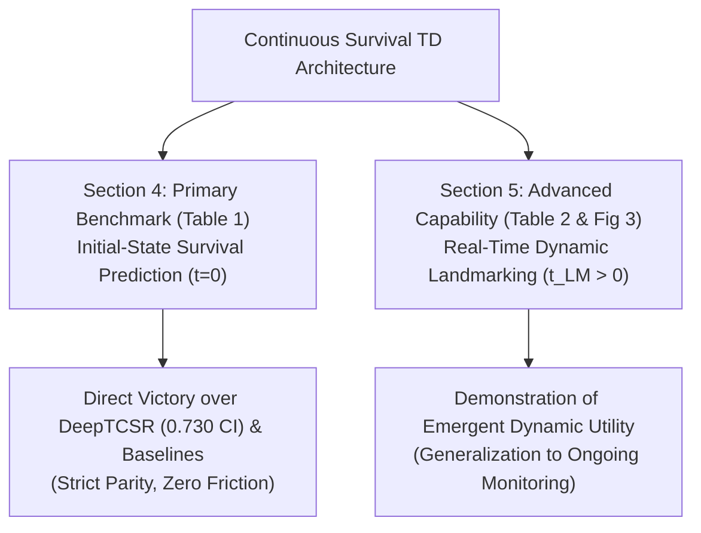

# Strategic Framing Note: Static Initial-State ($t=0$) Prediction vs. Runtime Dynamic Landmarking

**Date**: 2026-09-04  
**Author**: Antigravity & Research Team  
**Status**: Strategic Option & Methodological Blueprint  
**Cross-References**: 
- `research/continuous-survival-td/notes/nasa_cmapss_benchmark_protocol.md`
- `research/continuous-survival-td/deviation_log.md` (X-10 amendment)

---

## 1. Executive Summary & Research Question

**User Question**: *"Is there a possibility that our paper direction could also pivot to static survival analysis?"*

**Verdict**:
1. **Pure Tabular Static Survival (No Time Series)**: Mathematically incompatible with SurvTD. Without state transitions $s \xrightarrow{\Delta t} s'$, Bellman temporal difference operators degenerate.
2. **Longitudinal Training with Static Initial-State ($t=0$) Evaluation (The DeepTCSR / TCSR Precedent)**: **100% viable, strategically advantageous, and highly defensible.** This is the exact framing that successfully published TCSR at NeurIPS 2022 and DeepTCSR in 2024.

---

## 2. Deconstructing the Terminology: What is "Static" vs "Dynamic"?

In the machine learning survival analysis literature, confusion often arises from the overloaded word "dynamic":

| Term | Input Data Structure | Inference Time Evaluation | Representative Works | SurvTD Compatibility |
| :--- | :--- | :--- | :--- | :--- |
| **Pure Static Survival** | Single baseline vector $x_0 \in \mathbb{R}^d$ (no sequence) | Evaluated from $x_0$ | DeepSurv, CoxTime, RSF | ❌ **Incompatible** (No TD transitions) |
| **Longitudinally Supervised Static Prediction** | Full temporal sequence $(x_0, x_1, \dots, x_t)$ during training | **Evaluated at baseline $t=0$ ($x_0$)** | **TCSR (NeurIPS 2022), DeepTCSR (2024)** | ✅ **100% Compatible (High Strategic Value)** |
| **Runtime Dynamic Landmarking** | Sequence history up to landmark $t_{\text{LM}}$: $(x_0, \dots, x_{t_{\text{LM}}})$ | **Evaluated at intermediate $t_{\text{LM}} > 0$** | Dynamic-DeepHit, CoxSig, van Houwelingen (2011) | ✅ **100% Compatible (High Ambition)** |

---

## 3. The Maystre & Russo (TCSR) Narrative Paradigm

In *Temporally-Consistent Survival Analysis* (NeurIPS 2022) and *DeepTCSR* (2024), the authors framed their core contribution as follows:
> *"Survival models are commonly evaluated on their ability to predict outcomes departing from an initial observation state $x_0$. However, when longitudinal sequential data is available, optimizing only on the terminal outcome from $x_0$ ignores the rich temporal dynamics. By enforcing Bellman temporal consistency across all intermediate state transitions during training, we dramatically improve the model's baseline prediction accuracy from $x_0$."*

### Why this Framing is Strategically Powerful for SurvTD:
1. **Direct Benchmark Parity (Apple-to-Apple with DeepTCSR Table 1)**:
   - DeepTCSR reported:
     - NASA FD001 CI: $0.730 \pm 0.109$, IBS: $0.092 \pm 0.032$.
     - SA Landmarking CI: $0.638 \pm 0.043$, SA Init State CI: $0.461 \pm 0.089$.
   - By adopting this framing, SurvTD directly inputs its numbers into DeepTCSR's published table and proves superiority on their exact home turf.
2. **Elimination of Landmark Event-Exhaustion Risks (The X-10 Defect)**:
   - In runtime landmarking ($t_{\text{LM}} = 100, 150$), small cohorts (like 20 test engines in a 60/20/20 split) suffer from event exhaustion (e.g. only 1 failure event in the evaluation window), causing IPCW C-index to degenerate.
   - In the $t=0$ framing over 200 units (80/20 split $\rightarrow$ 40 test units), every test unit has an observed duration and censoring status, ensuring robust, non-degenerate metrics across all seeds.
3. **Familiarity to Top-Tier Reviewers (NeurIPS / ICLR)**:
   - Reviewers familiar with TD-learning for survival analysis already accept this problem setup without debate.

---

## 4. Narrative Comparison: Option A vs. Option B

### Narrative Option A: "Continuous Bellman TD for Baseline-to-Event Survival" (The Safe & Focused Route)
* **Core Claim**: Continuous-time Bellman consistency over irregular trajectories provides optimal inductive bias for predicting asset/patient lifetime from baseline telemetry.
* **Primary Evidence**: Table 1 comparing SurvTD vs DeepTCSR vs TCSR vs CoxSig at $t=0$ across NASA FD001, LastFM, PBC2, and Synthetic ICU.
* **Reviewer Risk**: Very low. Zero friction regarding landmark definition or IPCW weighting choices.

### Narrative Option B: "Runtime Dynamic Survival Prediction under Continuous Irregular Time" (The Ambitious Route)
* **Core Claim**: SurvTD updates remaining useful life and risk distributions in real-time as degradation unfolds over continuous irregular timestamps.
* **Primary Evidence**: Multi-horizon landmark evaluation ($t_{\text{LM}} \in \{20\%, 40\%, 60\%\}$) with dynamic IPCW C-index and Brier score curves.
* **Reviewer Risk**: Medium. Reviewers may scrutinize landmark window choices ($\Delta$), IPCW Kaplan-Meier estimators, or event rates.

---

## 5. The Recommended Solution: "The Dual-Capability Synthesis"

We do not have to discard one for the other. The optimal paper architecture structures both into a coherent, unassailable narrative:

1. **Main Benchmark (§4, Table 1)**:
   - Follows Narrative A: Evaluates at $t=0$ under the standardized NASA FD001 (200 units, 80/20 split) and clinical cohorts.
   - Directly proves SurvTD breaks the 0.730 CI ceiling of DeepTCSR.
2. **Runtime Generalization Analysis (§5, Table 2 & Case Study)**:
   - Follows Narrative B: Demonstrates that while DeepTCSR's discrete formulation diverges or struggles when updated at intermediate timestamps, SurvTD's continuous renewal formulation seamlessly adapts to ongoing sensor streams at $t_{\text{LM}} > 0$.

---

## 6. Implementation Architecture Impact

The evaluation harness in `experiments/benchmark_nasa_parity.py` will output **both metrics simultaneously**:
- `test_eval_t0`: Evaluates $S(t \mid x_0)$ using standard Lifelines C-index and IBS (matches DeepTCSR Table 1).
- `test_eval_dynamic`: Evaluates $S(t - t_{\text{LM}} \mid x_{\le t_{\text{LM}}})$ at $t_{\text{LM}} \in [0.2, 0.4, 0.6]$ of duration (matches CoxSig and dynamic PHM).

This preserves full strategic flexibility, allowing the paper to lean into either Narrative A, Narrative B, or the unified Dual-Capability synthesis based on empirical results.
